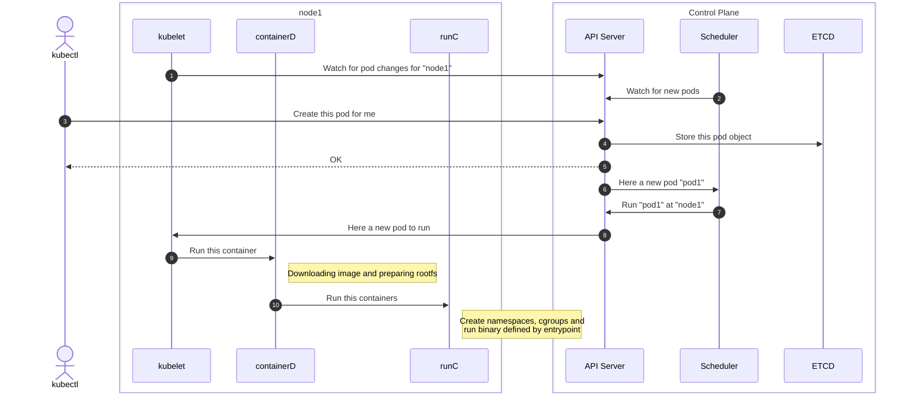

<div class="w-full h-full flex flex-justify-end flex-items-end">
    <span class="m-b-10" style="color: #181825; text-shadow: 2px 1px #bac2de;">
        <span class="fancy-headline">
            Beesting
        </span>
        <br/>
        <span class="fancy-headline-small">
            Can't touch this
        </span>
    </span>
</div>

<div class="attribution">
    <a href="https://pixabay.com/photos/sunflower-flower-bee-insect-6545123/">Image by mariya_m</a> on pixabay
</div>


---
layout: full
---

<div class="grid grid-cols-[1fr_35%] gap-6">

<div>
<h1 class="bold">Who am I?</h1>

<br/>

<h2>Software engineer turned Cloud Enthusiast <noto-cloud /></h2>
<br/>
<h2>Kubernetes wizard <noto-magic-wand /></h2>
<br/>
<h2>Linux Nerd <devicon-linux /></h2>
</div>

<div>

</div>

</div>

<!--
Originally I started my career as a Java Software Developer, but everything changed when I stumbled
upon Linux and the cloud. This definitely transformed me into a full-on Linux nerd. Do not question the MacBook though.
-->

---
layout: image
image: /time.jpg
backgroundSize: 110%
---

<div class="attribution">
    <a href="https://www.freepik.com/free-photo/close-up-woman-with-watch_21768055.htm#fromView=search&page=1&position=28&uuid=a87f4551-9928-476a-9f10-f078c92b901e">Image by Freepik</a> on Freepik
</div>

---
layout: image
image: /dyantrace_blog.png
backgroundSize: 80%
---

<div class="attribution">
    <a href="https://www.dynatrace.com/news/blog/context-aware-security-incident-response/">Link</a> to blog
</div>

---
layout: image
image: /dynatrace_diagram.excalidraw.svg
backgroundSize: 80%
---

---
layout: image
image: /honeytoken.jpg
backgroundSize: 100%
---

<div class="h-full" style="display: flex; justify-content: end; flex-direction: column">
    <span id="headline" style="color: #eff1f5">
        <span class="fancy-headline-small">What even is a</span><br/>
        <span class="fancy-headline">Honeytoken?</span>
    </span>
</div>

<style>
#headline {
    text-shadow: 3px 2px #11111b;
}
</style>

<div class="attribution">
    <a href="https://www.freepik.com/free-photo/close-up-honey-dripping-off-wooden-dipper-with-copy-space_6073844.htm#fromView=search&page=1&position=4&uuid=a963c1e3-765e-4800-98fc-b014e200ee61">Image by Freepik</a> on Freepik
</div>

---
layout: fact
class: bg-[#8bd5ca] color-[#e64553]
---

# Digital bait

---
layout: image
image: /cms.png
backgroundSize: 80%
---
---
layout: image
image: /cms_cve.png
backgroundSize: 80%
---
---
layout: full
class: code-fill
---

```shellsession {|2,3,10,}
$ root@simpecms-...:/root# env
KUBERNETES_SERVICE_PORT_HTTPS=443
KUBERNETES_SERVICE_PORT=443
HOSTNAME=simpecms-6c4bfc97cd-wdnhv
PHP_VERSION=7.4.9
APACHE_CONFDIR=/etc/apache2
PHP_LDFLAGS=-Wl,-O1 -pie
PWD=/var/www/html
HOME=/root
KUBERNETES_PORT_443_TCP=tcp://10.96.0.1:443
TERM=xterm
PHP_URL=https://www.php.net/distributions/php-7.4.9.tar.xz
...
```

---
layout: full
class: code-fill
---

```shellsession {|5}
$ root@simpecms-...:/root# ls -al /var/run/secrets/
total 20
drwxr-xr-x 4 root root 4096 Jan  5 09:57 .
drwxr-xr-x 1 root root 4096 Jan  5 09:57 ..
drwxr-xr-x 2 root root 4096 Jan  5 09:57 eks.amazonaws.com
drwxr-xr-x 3 root root 4096 Jan  5 09:57 kubernetes.io
```
---
layout: full
class: code-fill
---

```shellsession {|12}
$ root@simpecms-...:/root# ls -al /var/run/secrets/
total 20
drwxr-xr-x 4 root root 4096 Jan  5 09:57 .
drwxr-xr-x 1 root root 4096 Jan  5 09:57 ..
drwxr-xr-x 2 root root 4096 Jan  5 09:57 eks.amazonaws.com
drwxr-xr-x 3 root root 4096 Jan  5 09:57 kubernetes.io

$ root@simpecms-...:/root# ls -al /var/run/secrets/eks.amazonaws.com/
total 12
drwxr-xr-x 2 root root 4096 Jan  5 09:57 .
drwxr-xr-x 4 root root 4096 Jan  5 09:57 ..
-rw-r--r-- 1 root root   16 Jan  5 09:57 access_key_token
```
---
layout: full
class: code-fill
---

```shellsession {14}
$ root@simpecms-...:/root# ls -al /var/run/secrets/
total 20
drwxr-xr-x 4 root root 4096 Jan  5 09:57 .
drwxr-xr-x 1 root root 4096 Jan  5 09:57 ..
drwxr-xr-x 2 root root 4096 Jan  5 09:57 eks.amazonaws.com
drwxr-xr-x 3 root root 4096 Jan  5 09:57 kubernetes.io

$ root@simpecms-...:/root# ls -al /var/run/secrets/eks.amazonaws.com/
total 12
drwxr-xr-x 2 root root 4096 Jan  5 09:57 .
drwxr-xr-x 4 root root 4096 Jan  5 09:57 ..
-rw-r--r-- 1 root root   16 Jan  5 09:57 access_key_token

$ root@simpecms-...:/root# cat /v/r/s/eks.amazonaws.com/access_key_token
```

---
layout: image
image: /trap_card_meme.png
backgroundSize: 60%
---

---
layout: image
image: /beesting_overview.excalidraw.svg
backgroundSize: 80%
---

---
layout: image
image: /ship.jpg
backgroundSize: 100%
---

<div class="w-full h-full flex flex-justify-start flex-items-end">
    <span class="m-b-10 color-[#e64553]" style="text-shadow: 2px 1px #bac2de;">
        <span class="fancy-headline-small">
            How does <br/>
        </span>
        <span class="fancy-headline">
            Kubernetes <br/>
        </span>
        <span class="fancy-headline-small">
            work?
        </span>
    </span>
</div>

<div class="attribution">
    <a href="https://www.freepik.com/free-photo/aerial-view-container-cargo-ship-sea_13180315.htm#fromView=search&page=1&position=6&uuid=e5f2b7b3-d2d2-49b2-926e-eba339ed6a5b">Image by tawatchai07</a> on Freepik
</div>

---
layout: image
image: /kubernetes_overview.excalidraw.svg
backgroundSize: 100%
---
---
layout: image
image: /kubernetes_overview_node.excalidraw.svg
backgroundSize: 100%
---
---
layout: full
---

<div class="full-center">



</div>

---
layout: image
image: /woman_thinking.jpg
backgroundSize: 110%
---

<div class="w-full h-full flex flex-justify-end flex-items-start">
    <span class="" style="color: #fcfc64; text-shadow: 2px 1px #bac2de;">
        <span class="fancy-headline-smaller">
            How do we get the<br/>
        </span>
        <span class="fancy-headline-small">
            Honeytoken<br/>
        </span>
        <span class="fancy-headline-smaller">
            into the container?
        </span>
    </span>
</div>

<div class="attribution">
    <a href="https://www.freepik.com/free-photo/contemplative-female-looks-seriously-pensively-aside-purses-lips-concentrated-dressed-green-loose-jumper-makes-choice-mind_12930208.htm#fromView=search&page=7&position=29&uuid=f0298062-b6e1-429b-95cb-12126fe0161b">Image by wayhomestudio</a> on Freepik
</div>

---
layout: image
image: /dynatrace_diagram_detailed.excalidraw.svg
backgroundSize: 80%
---
---
layout: full
class: code-fill code-small-font
---

```yaml {|14}
apiVersion: v1
kind: Pod
metadata:
  name: "myapp"
  namespace: default
spec:
  containers:
  - name: myapp
    image: "myapp:latest"
    volumeMounts:
    - name: honey-volume
      readOnly: true
      subPath: token
      mountPath: /run/secrets/eks.amazonaws.com/s3_token
  volumes:
    - name: honeytoken
      secret:
        secretName: honeytoken

```
---
layout: image
image: /beesting_overview_webhook.excalidraw.svg
backgroundSize: 80%
---
---
layout: fact
class: bg-[#7287fd] color-[#e5c890]
---

# Boring

---
layout: image
image: /kubernetes_overview_node.excalidraw.svg
backgroundSize: 100%
---

<v-clicks>
<Arrow x1="800" y1="20" x2="660" y2="130" color="red" />
</v-clicks>

---
layout: image
image: /containerd_plugins.png
backgroundSize: 90%
---
---
layout: section
---

# Runtime

<v-clicks>

# Differ
# and a few more

</v-clicks>

---
layout: fact
---

# Differ Plugins

---
layout: fact
---

# Node Resource Interface

---
class: code-small-font
---

```go {|8}
type handlers struct {
	Configure           func(...) (api.EventMask, error)
	Synchronize         func(...) ([]*api.ContainerUpdate, error)
	Shutdown            func(...)
	RunPodSandbox       func(...) error
	StopPodSandbox      func(...) error
	RemovePodSandbox    func(...) error
	CreateContainer     func(...) (*api.ContainerAdjustment, []*api.ContainerUpdate, error)
	StartContainer      func(...) error
	UpdateContainer     func(...) ([]*api.ContainerUpdate, error)
	StopContainer       func(...) ([]*api.ContainerUpdate, error)
	RemoveContainer     func(...) error
	PostCreateContainer func(...) error
	PostStartContainer  func(...) error
	PostUpdateContainer func(...) error
}
```

---
layout: section
---

<div class="p-10">

```go {|3|5}
type ContainerAdjustment struct {
	Annotations map[string]string
	Mounts      []*Mount
	Env         []*KeyValue
	Hooks       *Hooks
	Linux       *LinuxContainerAdjustment
	Rlimits     []*POSIXRlimit
	CDIDevices  []*CDIDevice
}
```

</div>

---
layout: image
image: /linux_vfs.excalidraw.svg
backgroundSize: 60%
---

<v-clicks>

<Arrow color="red" x1="750" y1="105" x2="700" y2="305" />

</v-clicks>

---
layout: image
image: /eww_brother.jpg
backgroundSize: 100%
---

<div class="attribution">
    <a href="https://www.freepik.com/free-photo/displeased-man-refusing-stretching-hand-grey-wall_8357236.htm#fromView=search&page=3&position=44&uuid=0d989872-e200-4027-a513-1dd4035a9a91">Image by cookie_studio</a> on pixabay
</div>

---
layout: image
image: /linux_vfs_fuse.excalidraw.svg
backgroundSize: 60%
---

<v-clicks>

<Arrow color="red" x1="850" y1="105" x2="750" y2="150" />

</v-clicks>

---
layout: image
image: /eww_brother.jpg
backgroundSize: 100%
---

<div class="attribution">
    <a href="https://www.freepik.com/free-photo/displeased-man-refusing-stretching-hand-grey-wall_8357236.htm#fromView=search&page=3&position=44&uuid=0d989872-e200-4027-a513-1dd4035a9a91">Image by cookie_studio</a> on pixabay
</div>

---
layout: section
---

```go
type Hooks struct {
	Prestart        []*Hook
	CreateRuntime   []*Hook
	CreateContainer []*Hook
	StartContainer  []*Hook
	Poststart       []*Hook
	Poststop        []*Hook
}
```

---
layout: image
image: /create_runtime_hook.png
backgroundSize: 70%
---

<div class="attribution">
    <a href="https://github.com/opencontainers/runtime-spec/blob/v1.2.0/config.md#createRuntime-hooks">Link</a> to docs
</div>

---
layout: image
image: /beesting_pocv1.excalidraw.svg
backgroundSize: 90%
---

<v-click>
    <span class="absolute top-40 right-30 text-align-center color-red">extracted to <br/> /tmp/beesting</span>
    <Arrow x1="740" y1="210" x2="580" y2="275" color="red" />
</v-click>

---
layout: image
image: /tailscale_atomicfile.png
backgroundSize: 70%
---

<div class="attribution">
    <a href="https://github.com/tailscale/tailscale/blob/main/atomicfile/atomicfile.go">tailscale/atomicfile/atomicfile.go</a>
</div>

---
layout: full
class: code-fill code-small-font
---

```shellsession
$ skaffold run
...
Waiting for deployments to stabilize...
Deployments stabilized in 5.024708ms
You can also run [skaffold run --tail] to get the logs
```

---
layout: full
class: code-fill code-small-font
---

```shellsession
$ skaffold run
...
Waiting for deployments to stabilize...
Deployments stabilized in 5.024708ms
You can also run [skaffold run --tail] to get the logs

$ k apply -f HACK/dummy.yaml
deployment.apps/dummy created
```

---
layout: full
class: code-fill code-small-font
---

```shellsession
$ skaffold run
...
Waiting for deployments to stabilize...
Deployments stabilized in 5.024708ms
You can also run [skaffold run --tail] to get the logs

$ k apply -f HACK/dummy.yaml
deployment.apps/dummy created

$ k get pods
NAME                        READY   STATUS              RESTARTS     AGE
beesting-agent-q9s2d        1/1     Running             0            54s
dummy-8984df79-zpvnm        0/1     RunContainerError   2 (4s ago)   20s
```

---
layout: full
class: code-fill code-small-font
---

```shellsession {|19}
$ k describe pod dummy-8984df79-zpvnm
Name:             dummy-8984df79-zpvnm
Namespace:        default
Priority:         0
Service Account:  default
Node:             beestinger-control-plane/172.18.0.3
...
Events:
Type    Reason  Age              From     Message
----    ------  ----             ----     -------
...
Warning Failed  8s (x4 over 49s) kubelet  Error:   failed  to   create  containerd
                                          task:  failed to  create shim  task: OCI
                                          runtime   create  failed:   runc  create
                                          failed:   unable   to  start   container
                                          process:  error  during container  init:
                                          error   running   hook   #1:   fork/exec
                                          /tmp/beesting/beesting-hook:
                                          permission denied: unknown
```

---
layout: image
image: /wat.jpg
backgroundSize: 100%
---

<div class="attribution">
    <a href="https://www.freepik.com/free-photo/crazy-sports-man-funny-expression_1029941.htm#fromView=search&page=1&position=51&uuid=815cb5f2-05d5-476a-bee7-e5eb48379901">Image by kues1</a> on Freepik
</div>

---
layout: section
class: code-small-font
---

```shellsession
Error:  failed  to   create  containerd  task:  failed  to   create  shim  task:
OCI  runtime  create failed:  runc  create  failed:  unable to  start  container
process:  error  during  container  init:   error  running  hook  #1:  fork/exec
/tmp/beesting/beesting-hook: permission denied: unknown
```

---
layout: section
class: code-small-font
---

```shellsession {|9}
$ root@beestinger-control-plane:/# mount
proc on /proc type proc (rw,nosuid,nodev,noexec,relatime)
tmpfs on /dev type tmpfs (rw,nosuid,size=65536k,mode=755,inode64)
devpts on /dev/pts type devpts (rw,nosuid,noexec,relatime,gid=5,mode=620,ptmxmode=666)
sysfs on /sys type sysfs (ro,nosuid,nodev,noexec,relatime)
...
mqueue on /dev/mqueue type mqueue (rw,nosuid,nodev,noexec,relatime)
shm on /dev/shm type tmpfs (rw,nosuid,nodev,noexec,relatime,size=65536k,inode64)
tmpfs on /tmp type tmpfs (rw,nosuid,nodev,noexec,relatime,inode64)
/dev/vda1 on /var type ext4 (rw,relatime,discard,errors=remount-ro)
devpts on /dev/console type devpts (rw,nosuid,noexec,relatime,gid=5,mode=620,ptmxmode=666)
tmpfs on /run/lock type tmpfs (rw,nosuid,nodev,noexec,relatime,size=5120k,inode64)
...
```
---
layout: image
image: /istio.png
backgroundSize: 90%
---

<div class="w-full h-full flex flex-justify-end flex-items-start color-red">
    <span class="p-r-30 p-t-20">/opt/cni/bin</span>
</div>

<Arrow x1="750" y1="150" x2="540" y2="245" color="red" />

<div class="attribution">
    <a href="https://github.com/istio/istio/blob/1.24.2/cni/pkg/install/install.go#L57-L64">cni/pkg/install/install.go</a>
</div>

---
layout: image
image: /beesting_pocv1.excalidraw.svg
backgroundSize: 90%
---

<span v-click>
    <span class="absolute top-40 right-30 text-align-center color-red">extracted to <br/> /opt/beesting/bin</span>
    <Arrow x1="720" y1="210" x2="580" y2="275" color="red" />
</span>

<span v-click.hide="1">
    <span class="absolute top-40 right-30 text-align-center color-red">extracted to <br/> /tmp/beesting</span>
    <Arrow x1="740" y1="210" x2="580" y2="275" color="red" />
</span>

---
layout: full
class: code-fill code-small-font
---

```shellsession {|16}
$ skaffold run
...
Waiting for deployments to stabilize...
Deployments stabilized in 5.024708ms
You can also run [skaffold run --tail] to get the logs

$ k delete -f HACK/dummy.yaml
deployment.apps/dummy deleted

$ k apply -f HACK/dummy.yaml
deployment.apps/dummy created

$ k get pods
NAME                        READY   STATUS              RESTARTS     AGE
beesting-agent-q9s2d        1/1     Running             0            30s
dummy-8984df79-zpvnm        1/1     Running             0            52s
```

---
layout: full
class: code-fill
---

```shellsession
$ k exec deploy/dummy -it -- ls -alh /var/run/secrets/eks.amazonaws.com/
total 12K
drwxr-xr-x    2 root     root        4.0K Jan  6 15:11 .
drwxr-xr-x    4 root     root        4.0K Jan  6 15:11 ..
-r--r--r--    1 root     root          16 Jan  6 15:11 access_key_token
```
---
layout: section
---

# Complex Build process

<v-clicks>

# Hard to follow

</v-clicks>

---
layout: image
image: /beesting_pocv1.excalidraw.svg
backgroundSize: 90%
---

<span class="absolute top-60 right-30 text-align-center color-red">replace hook</span>
<Arrow x1="750" y1="260" x2="580" y2="290" color="red" />

---
layout: image
image: /beesting_pocv2.excalidraw.svg
backgroundSize: 90%
---

<span class="absolute top-60 right-30 text-align-center color-red">with mount</span>
<Arrow x1="750" y1="260" x2="610" y2="310" color="red" />

---
layout: image
image: /bind_mount.excalidraw.svg
backgroundSize: 90%
---

---
layout: full
class: code-fill code-small-font
---

```shellsession {|16}
$ skaffold run
...
Waiting for deployments to stabilize...
Deployments stabilized in 5.024708ms
You can also run [skaffold run --tail] to get the logs

$ k delete -f HACK/dummy.yaml
deployment.apps/dummy deleted

$ k apply -f HACK/dummy.yaml
deployment.apps/dummy created

$ k get pods
NAME                        READY   STATUS              RESTARTS     AGE
beesting-agent-x2g8w        1/1     Running             0            30s
dummy-8984df79-isz1s        1/1     Running             0            52s
```

---
layout: full
class: code-fill
---

```shellsession
$ k exec deploy/dummy -it -- ls -alh /var/run/secrets/eks.amazonaws.com/
total 12K
drwxr-xr-x    2 root     root        4.0K Jan  6 16:51 .
drwxr-xr-x    4 root     root        4.0K Jan  6 16:51 ..
-r--r--r--    1 root     root          16 Jan  6 16:51 access_key_token
```

---
layout: image
image: /great_success.png
backgroundSize: 80%
---
---
layout: image
image: /EBPF_logo.png
backgroundSize: 80%
---
---
layout: image
image: /ebpf_so_hot_meme.png
backgroundSize: 70%
---
---
layout: image
image: /ebpf_comic.png
backgroundSize: 80%
---

<div class="attribution">
    eBPF Comic by Philipp Meier and Thomas Graf
</div>

---
layout: image
image: /ebpf_source_to_vm.excalidraw.svg
backgroundSize: 80%
---
---

# Unbounded Loops

<v-click>
    <div class="absolute top-0 bottom-0 right-0 left-0 text-align-center p-20">
        <svg xmlns="http://www.w3.org/2000/svg" viewBox="0 0 100 100" width="100%" height="100%" preserveAspectRatio="meet">
          <line x1="20" y1="20" x2="80" y2="80" stroke="red" stroke-width="10"/>
          <line x1="80" y1="20" x2="20" y2="80" stroke="red" stroke-width="10"/>
        </svg>
    </div>
</v-click>

---
layout: image
image: /verifier_approved.jpg
backgroundSize: 80%
---
<div class="attribution">
    <a href="https://www.freepik.com/free-photo/close-up-woman-with-watch_21768055.htm#fromView=search&page=1&position=28&uuid=a87f4551-9928-476a-9f10-f078c92b901e">Image by Freepik</a> on Freepik
</div>

---
layout: image
image: /map_architecture.png
backgroundSize: 70%
---

---
layout: section
---

# Map Types

<div class="items">

* HashTable, Arrays
* LRU (Least Recently Used)
* Perf and Ring Buffer
* ...

</div>

---
layout: image
image: /helper.png
backgroundSize: 90%
---

---
layout: section
---

# Helpers

<div class="items">

* bpf_get_current_pid_tgid
* bpf_map_lookup_elem
* bpf_map_delete_elem
* ...

</div>

---
layout: image
image: /fs_basic.excalidraw.svg
backgroundSize: 80%
---

---
layout: section
---

<div class="items">

* open
* openat
* symlinks
* ...

</div>

---
layout: image
image: /choice_overload.jpg
backgroundSize: 80%
---

<div class="attribution">
    <a href="https://www.freepik.com/free-photo/frustrated-unhappy-man-cries-with-despair-expresses-negative-emotions-wears-sticky-notes-around-whole-body-head-poses-indoor-against-pink-wall-has-dejected-miserable-expression_13577814.htm#fromView=search&page=1&position=8&uuid=6e0e6875-60f9-49d9-930f-e418fd181715">Image by wayhomestudio</a> on Freepik
</div>

---
layout: image
image: /lsm_illustration.excalidraw.svg
backgroundSize: 80%
---
